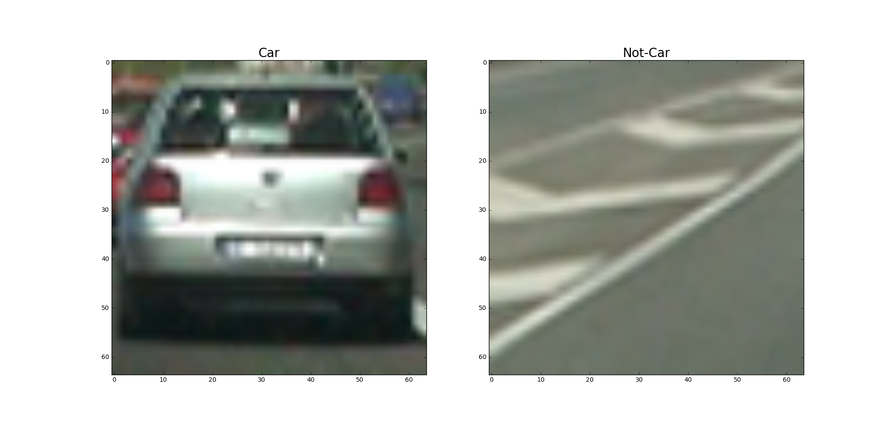

##Project P5 Vehicle Detection and Tracking

---

**Vehicle Detection Project**

The goals / steps of this project are the following:

* Perform a Histogram of Oriented Gradients (HOG) feature extraction on a labeled training set of images and train a classifier Linear SVM classifier
* Optionally, apply a color transform and append binned color features, as well as histograms of color, to the HOG feature vector. 
* For those first two steps, normalize the features and randomize a selection for training and testing.
* Implement a sliding-window technique and use the trained classifier to search for vehicles in images.
* Run the pipeline on a video stream (start with the test_video.mp4 and later implement on full project_video.mp4) and create a heat map of recurring detections frame by frame to reject outliers and follow detected vehicles.
* Estimate a bounding box for vehicles detected.

---

###Histogram of Oriented Gradients (HOG)

####1. How to extract HOG features from the training images.

The code for this step is contained in the code cell #1 of the IPython notebook in `get_hot_features()` function.  

I started by reading in all the `vehicle` and `non-vehicle` images and stored them in arrays `cars[]` and `notcars[]` (code cell #1, line 120 to line 148).  There are 8792 `vehicle` images and 8968 `non-vehicle` images for training and testing. Here is an example of images from the `vehicle` and `non-vehicle` classes:




####2. The final choice of HOG parameters.

I then explored different color spaces and different `skimage.hog()` parameters (`orientations`, `pixels_per_cell`, and `cells_per_block`). I settled on using the `YCrCb` color space, `ALL` color channels and HOG parameters of `orientations=8`, `pixels_per_cell=(8, 8)` and `cells_per_block=(2, 2)`, as it consistently yields over 98 to 99% accuracy score with a 80/20 train-test split. (code cell #1, `train_test_split()` at line 218). The parameters are listed in code cell #1, line 159 to 163.

```
color_space = 'YCrCb' # Can be RGB, HSV, LUV, HLS, YUV, YCrCb
orient = 8
pix_per_cell = 8
cell_per_block = 2
hog_channel = 'ALL' # Can be 0, 1, 2, or "ALL"
```

####3. How I trained a classifier using the selected HOG features and the Color features
In addition to the HOG feature, I also extracted 2 color features from the training data. First, the color histogram (code cell #1, line 96) and second, the spatial binning of color (code cell #1, line 92). Color histogram is useful as it can be used to identify unique color pattern in different regions with slightly different background in the image. The spatial binning of color is essentially a template matching technique, but with a lower resolution template as the relevant features can still be preserved at low resolution. Since both color features are not very robust, we augment them with HOG feature extraction.  Before the data was used for training, it was normalized using `StandardScaler()`(code cell #1, line 207) to avoid individual features or set of features dominating the response of the classifier. It was also randomly shuffled to avoid problems due to the ordering of the data. `random_state=rand_state` at code cell #1, line 218. After training the Linear SVM classifier, `LinearSVC()`, where the final accuracy score is greater than 99%, I stored the training results to a pickle file called `feature_vector_pickle_fullset.p`. The key results that were saved are `svc`, `X_scaler`, `color_space`, `orient`,`pixel_per_cell` and `cell_per_block` because they will be used later for finding the cars in the video frames.
###Sliding Window Search

####1. Describe how (and identify where in your code) you implemented a sliding window search.  How did you decide what scales to search and how much to overlap windows?

I decided to search random window positions at random scales all over the image and came up with this (ok just kidding I didn't actually ;):

![alt text][image3]

####2. Show some examples of test images to demonstrate how your pipeline is working.  What did you do to optimize the performance of your classifier?

Ultimately I searched on two scales using YCrCb 3-channel HOG features plus spatially binned color and histograms of color in the feature vector, which provided a nice result.  Here are some example images:

![alt text][image4]
---

### Video Implementation

####1. Provide a link to your final video output.  Your pipeline should perform reasonably well on the entire project video (somewhat wobbly or unstable bounding boxes are ok as long as you are identifying the vehicles most of the time with minimal false positives.)
Here's a [link to my video result](./project_video.mp4)


####2. Describe how (and identify where in your code) you implemented some kind of filter for false positives and some method for combining overlapping bounding boxes.

I recorded the positions of positive detections in each frame of the video.  From the positive detections I created a heatmap and then thresholded that map to identify vehicle positions.  I then used `scipy.ndimage.measurements.label()` to identify individual blobs in the heatmap.  I then assumed each blob corresponded to a vehicle.  I constructed bounding boxes to cover the area of each blob detected.  

Here's an example result showing the heatmap from a series of frames of video, the result of `scipy.ndimage.measurements.label()` and the bounding boxes then overlaid on the last frame of video:

### Here are six frames and their corresponding heatmaps:

![alt text][image5]

### Here is the output of `scipy.ndimage.measurements.label()` on the integrated heatmap from all six frames:
![alt text][image6]

### Here the resulting bounding boxes are drawn onto the last frame in the series:
![alt text][image7]


---

###Discussion

####1. Briefly discuss any problems / issues you faced in your implementation of this project.  Where will your pipeline likely fail?  What could you do to make it more robust?

Here I'll talk about the approach I took, what techniques I used, what worked and why, where the pipeline might fail and how I might improve it if I were going to pursue this project further.  

