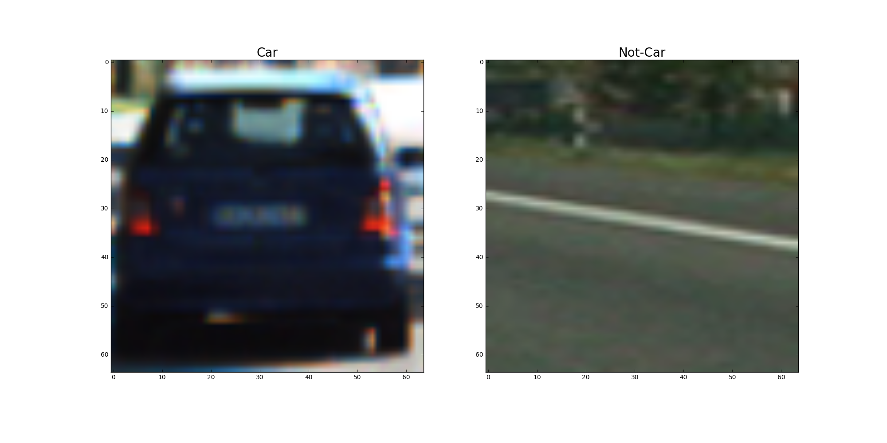
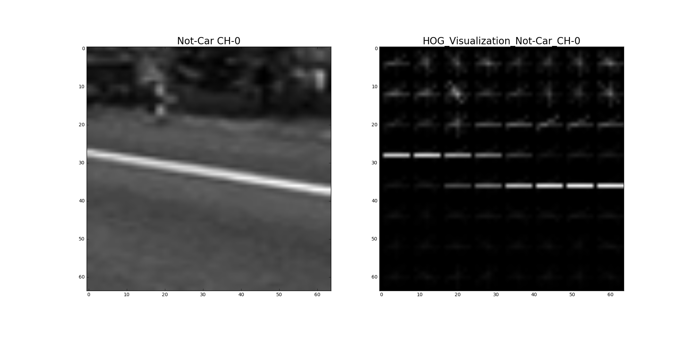
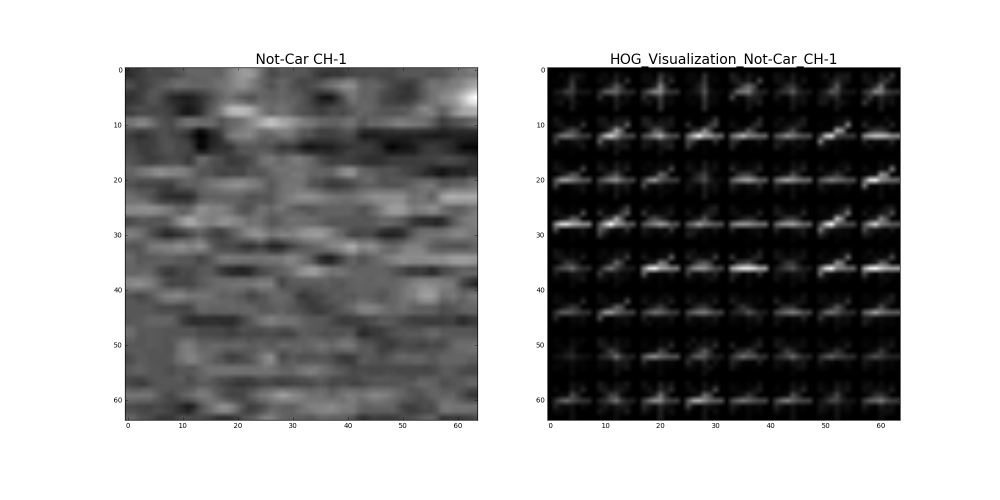
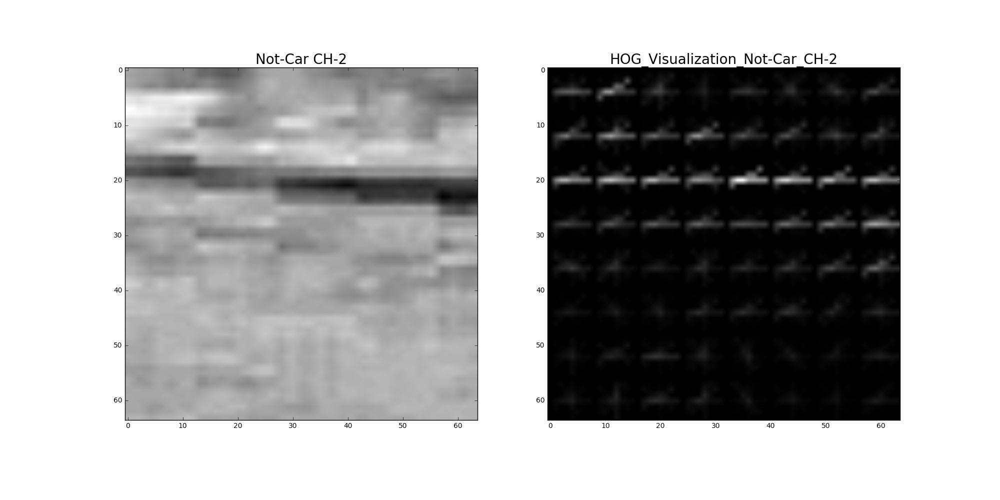

##Project P5 Vehicle Detection and Tracking

---

**Vehicle Detection Project**

The goals / steps of this project are the following:

* Perform a Histogram of Oriented Gradients (HOG) feature extraction on a labeled training set of images and train a classifier Linear SVM classifier
* Optionally, apply a color transform and append binned color features, as well as histograms of color, to the HOG feature vector. 
* For those first two steps, normalize the features and randomize a selection for training and testing.
* Implement a sliding-window technique and use the trained classifier to search for vehicles in images.
* Run the pipeline on a video stream (start with the test_video.mp4 and later implement on full project_video.mp4) and create a heat map of recurring detections frame by frame to reject outliers and follow detected vehicles.
* Estimate a bounding box for vehicles detected.

---

###Histogram of Oriented Gradients (HOG)

####1. How to extract HOG features from the training images.

The code for this step is contained in the code cell #1 of the IPython notebook in `get_hot_features()` function.  

I started by reading in all the `vehicle` and `non-vehicle` images in different directories and stored them in arrays `cars[]` and `notcars[]` (code cell #1, line 120 to line 148).  There are 8792 `vehicle` images and 8968 `non-vehicle` images for training and testing. Here is an example of images from the `vehicle` and `non-vehicle` classes:




####2. The final choice of HOG parameters.

I then explored different color spaces and different `skimage.hog()` parameters (`orientations`, `pixels_per_cell`, and `cells_per_block`). I settled on using the `YCrCb` color space, `ALL` color channels and HOG parameters of `orientations=8`, `pixels_per_cell=(8, 8)` and `cells_per_block=(2, 2)`, as it consistently yields over 99% accuracy score with a 80/20 train-test split. (code cell #1, `train_test_split()` at line 218). Also, the HOG features extracted from different channels of the YCrCb color space offer enough distinction from each other that it is worthwhile to extract features from `ALL` channels. This is demonstrated in the following HOG visualization with car/not-car images randomly picked from the training set. 








The parameters are listed in code cell #1, line 159 to 163.

```
color_space = 'YCrCb' # Can be RGB, HSV, LUV, HLS, YUV, YCrCb
orient = 8
pix_per_cell = 8
cell_per_block = 2
hog_channel = 'ALL' # Can be 0, 1, 2, or "ALL"
```

####3. How I trained a classifier using the selected HOG features and the Color features
In addition to the HOG feature, I also extracted 2 color features from the training data. First, the color histogram (code cell #1, line 96) and second, the spatial binning of color (code cell #1, line 92). Color histogram is useful as it can be used to identify unique color pattern in different regions with slightly different background in the image. The spatial binning of color is essentially a template matching technique, but with a lower resolution template because the relevant features can still be preserved at low resolution. Since both color features are not very robust on their own, we augment them with HOG features to form the final feature vector.  Before the data was used for training, it was normalized using `StandardScaler()`(code cell #1, line 207) to avoid individual features or set of features dominating the response of the classifier. It was also randomly shuffled to avoid problems due to the ordering of the data. `random_state=rand_state` at code cell #1, line 218. After training the Linear SVM classifier, `LinearSVC()`, where the final accuracy score is greater than 99%, I stored the training results to a pickle file called `feature_vector_pickle_fullset.p`. The key results that were saved are `svc`, `X_scaler`, `color_space`, `orient`,`pixel_per_cell` and `cell_per_block` because they can be repeated used later for finding the cars in the video frames without going through the training process again.
###Sliding Window Search

####1. HOG sub-sampling window search and the searching strategy

Applying the technique of HOG sub-sampling window search (function `find_cars()` at code cell #2, line 23) found in the Udacity lesson, I explored different window scales in different regions of the image. I was hoping to find an optimal scheme that divides the image to multiple, slightly overlapping regions, with greater window scales allocated for the regions closer to the bottom of the image. In theory, this scheme would require fewer search windows and thus less time to process. However, in my experience, I find the most consistent sliding window scheme is simply one region with a fixed window scale. It appears to generate many overlapping windows over the car objects using the 6 test images. I chose a high overlapping percentage `cells_per_step=1` because the denser the overlapping windows, the hotter the resulting heat map gets, which is easier to set a threshold to reject false positives. I also restricted the overall region for searching to `(ystart, ystop, xstart, xstop) = (400, 646, 442, 1280)` since we don't need to search above the horizon for cars and our car is driving on the left lane with no cars cutting in front of it. The obvious trade-off for this scheme is speed: there are 1343 sliding windows per frame, on the Mid 2014 15-inch Macbook Pro, this resulted only about 1.7-1.8 frames/sec processing speed, far below the real time processing speed, but I got basically no false positives.


####2. Show some examples of test images to demonstrate how your pipeline is working. 

Ultimately I searched on 1 windows scale = 1.2 using YCrCb 3-channel HOG features plus spatially binned color and histograms of color in the feature vector, which provided a good result.  Here are some example images using the HOG sub-sampling window search and heat map.


Overall, here are some steps that were taken to attempt to optimize the performance of the classifier:

* Experimenting with the number of windows by changing the scale.
   For example, 1.2 is the scale in `region0 = (400, 646, 442, 1280, 1.2)`, code cell #4, line 2. In theory, the fewer the sliding windows, the faster the processing time.
* Reducing the length of the feature vector by different combination of the following parameters, code cell #1, line 160-165. In general, the shorter the feature length, the quicker the features can be extracted for each frame.

```
orient = 8
pix_per_cell = 8
cell_per_block = 2
hog_channel = 'ALL' # Can be 0, 1, 2, or "ALL"
spatial_size = (32, 32)
hist_bins = 32
```
* Dividing the image into multiple regions with different window scale; the closer the region is to the bottom of the frame, the larger the window scale. Unfortunately, even though this yields faster processing time, but it did not provide better car detection. Further more, the larger window scale did not seem to be effective in detecting cars emerging from the bottom of the frame.


---

### Video Implementation

####1. Here's a link to my finished project video [Dropbox link](https://www.dropbox.com/s/kccs61la8hi5qxi/vehicle_detection_project_video.mp4?dl=0)


####2. How I used heat map and filter to reject false positives and integrated the heat map over the last N frames to create resulting bounding box 

Step 1
Using `find_cars()` function in code cell #6, line 17, I recorded the bounding box, `bbox_list`, of the positive detections in each frame of the video.  From the positive detections I created a heatmap and then thresholded that map to identify vehicle positions.  I then used `scipy.ndimage.measurements.label()` at code cell #6, line 33 to identify individual blobs in the heatmap.  I then assumed each blob corresponded to a vehicle.  I constructed bounding boxes to cover the area of each blob detected.  For each frame, these bounding boxes are stored in `centroid_list`

Step 2
To integrate heatmap over N frames where N is set to 11, instead of direct summation of heatmap, I appended the bounding boxes detected at each frame to `detected_window_list`. (code cell #6, line 37) Since there could be different number of bounding boxes detected for each frame, I flatten the list every 12 frames by calling `flatten = list(itertools.chain.from_iterable(detected_window_list))`(code cell #6, line 43) before applying threshold = 5 to create heatmap which is used to construct the resulting bounding boxes every 12 frames. Every 12 frames, the oldest frame is popped out the the `detected_window_list` to keep the data up-to-date. To drawing the final bounding boxes, a filter was used to reject small or odd sizes that are not representative of the car sizes near the bottom of the frame.
Here's an example showing the heatmap from a series of frames of the test video, the bounding boxes then overlaid using the integrated heatmap over the last N frames of the video:


### Here are 11 frames and their corresponding heatmaps:


### Here the resulting bounding boxes are drawn onto the last frame in the series:


---

###Discussion

####1. Problems / issues that I faced in my implementation of this project. 
* First, using the project tips from Udacity lesson, I spent a significant amount of time to manually remove the similar images in a time sequence before applying them on the linear SVM. I was able to achieve high accuracy score over 99% this way, but in reality the detection of vehicle did not appear to be superior. Later, I simply used the full set of project data to train the classifier.
* Second, the accuracy of the classifier seems to be less accurate in those frames where vehicle is either entering or exiting the frame at the bottom of the image. Typically, as the vehicle is entering the frame, it takes a second or so for the bounding box to appear. As the vehicle is exiting the frame from the bottom, the bounding box can sometimes disappear and reappear.
* Third, in those frames where 2 vehicles overlap at similar y coordinates, the 2 bounding boxes would merge due to the fact that the heatmap is not separable.
* Forth, I attempted to create a Vehicle class using the information from the Udacity Q&A session, but had a hard time using this class to reliably track and predict the location of the corresponding bounding box in the next frame. I settled on the solution of integrated heatmap over the last N frame to create the bounding boxes.
* If I had more time, I would like to train a convolutional neural network (CNN) using the same project data set and compare the performance. I am especially interested in the consistency of the vehicle detection bounding boxes and the processing time.
* If had more time to explore the HOG features, I would spend time to process the Udacity data or add other data set to see if the classifier can achieve better accuracy score and fewer false positives.
* It was suggested that compiling an Open CV version with CUDA support  could speed up processing time. If I had more time, I would explore this option and compare the performance of the pipeline.
